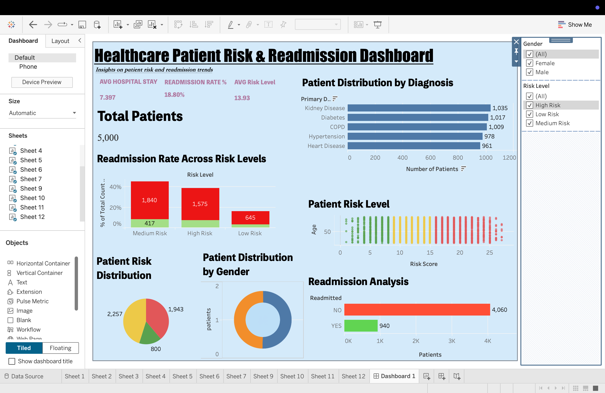

# Healthcare Patient Risk & Readmission Analysis

##  Project Overview

This project analyzes patient data to identify patterns in risk levels and hospital readmissions using Tableau.

##  Key Insights

* High-risk patients show higher readmission rates
* Medium-risk group forms the largest segment
* Diabetes and hypertension dominate diagnosis distribution

##  Tools Used

* SQL
* Tableau

##  Dashboard Preview

##  Files

* Tableau Dashboard: dashboard/tableau_dashboard.twbx

##  How to Use

Download the `.twbx` file and open it in Tableau Public to interact with the dashboard.
